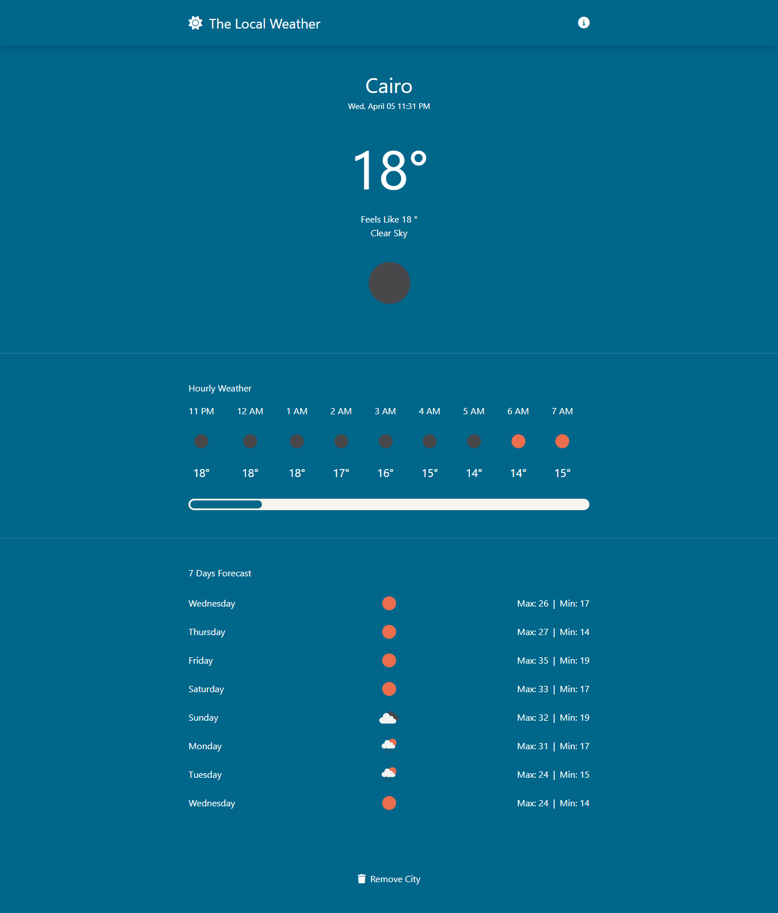

### Links

- Live Site URL: https://weather-app-blond-eight-32.vercel.app/

### Description

Users Can:

- View the optimal layout for the Weather App.
- Search The cities Weather .
- View the cities daily & hourly weather.
- Add city to their local storage so they can track its weather, and also remove
  it.
- Create their own city list.

### Tools

- HTML
- Tailwind CSS
- Vue 3
- Local Storage
- Axios
- APIs: Map Box & Open Weather
- UID
- FontAwesome
- Google Fonts

### Screenshot

  
